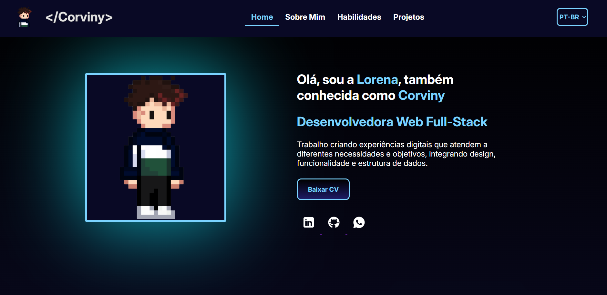

# 💼 Portifólio 💼
---

Este é o repositório do meu portfólio pessoal, desenvolvido para apresentar meus projetos, habilidades, e um pouco sobre mim. Ele foi criado com foco em design responsivo, performance e acessibilidade, com o objetivo de refletir minha identidade profissional e servir como porta de entrada para oportunidades na área de desenvolvimento.

### 🛠️ Status
**⚙️Trabalho em progresso**  
 Falta melhoria na responsividade, botão de baixar CV e função de mudar para o inglês!

---

## ✨ Features

-  Apresentação pessoal com breve biografia 
-  Links para redes sociais e contato 
-  Seção de projetos com links e descrições 
-  Design responsivo (compatível com desktop e mobile) `(melhorando)`
-  Animações suaves e interativas com CSS 
-  Versão em Inglês e Português `(fazendo)`

---

## 🛠️ Tecnologias utilizadas

  

---

### 🚀 Como visualizar
Você pode acessar a versão online do portfólio aqui: `não possui ainda`
